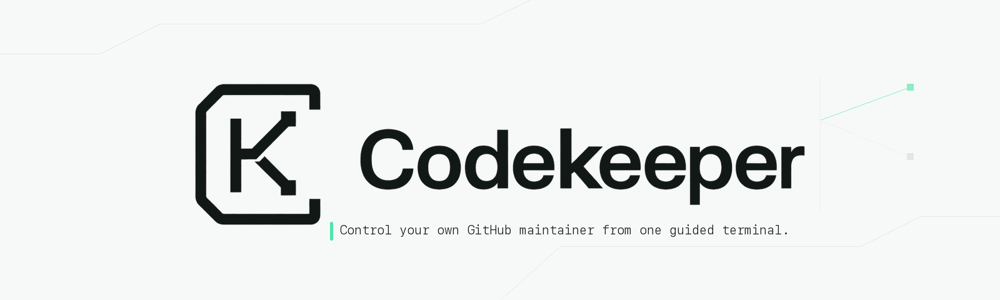
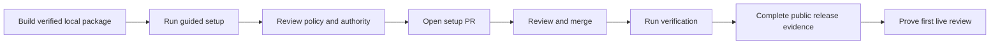
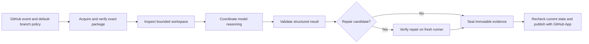

<h1 align="center">
  
</h1>


[](LICENSE)

Codekeeper is a repository-owned GitHub maintainer. It reviews pull requests, triages issues, audits repository health, and can prepare small, verified repairs from isolated GitHub Actions jobs.

> **Release status:** Codekeeper is intentionally unpublished. `codekeeper@0.2.0` was not available from npm on 17 August 2026. The supported evaluation path is an exact local tarball and SHA-512 receipt; public installation guidance will be enabled only after the release-readiness evidence is complete.

## ✨ What Codekeeper does

| Workflow | What it does | Starting authority |
|---|---|---|
| **Pull-request review** | Inspects a bounded comparison, publishes a living review summary, applies configured labels, and reports a review gate. | Automatic for supported same-repository PRs in the Recommended setup. Repair and merge stay off. |
| **Issue triage** | Classifies issues, checks exact duplicates, records readiness, and publishes one App-owned triage result. | Triage can be enabled independently. Duplicate closure and implementation require explicit opt-in. |
| **Repository maintenance** | Audits repository health and can publish bounded maintenance issues. | Manual runs are available in the Recommended setup. Scheduling and repair stay off. |
| **Repair and implementation** | Prepares a small patch, validates it, then updates an eligible PR or opens a bounded repair/implementation PR. | Disabled until a code-changing capability and trusted validation command are enabled. |
| **Owner assistant** | Routes exact commands from configured owners to installed workflows. | Exact commands from configured owners only. |

Codekeeper complements tests, approvals, security checks, and deployment gates. It does not replace them.

## 🚀 Evaluate from source

You need:

- a **GitHub.com** repository with admin access;
- **Node.js 22 or newer**;
- **Git** and an authenticated GitHub CLI;
- a clean checkout of the target repository's default branch; and
- an API key for at least one supported model provider.

Build an exact tarball from a clean Codekeeper checkout using [INSTALL.md](INSTALL.md), then run it from the target repository:

```bash
npm exec --package /absolute/path/to/codekeeper.tgz -- \
  codekeeper init --current-package --package-integrity 'sha512-...'
```

The guided installer checks repository state, lets you choose workflows, models, capabilities, validation commands, and GitHub App permissions, then:

1. creates a verified setup commit;
2. pushes `codekeeper/setup`;
3. configures required secret and variable names through GitHub CLI; and
4. opens a setup pull request.

It **does not merge** the pull request.

Choose **Recommended** for automatic PR review and manual maintenance. Scheduled maintenance, tracing, repair, issue implementation, duplicate closure, and automatic merge start off.

### Review and activate

Review the generated policy, workflows, models, validation commands, and GitHub App permissions. After merging the setup PR, run the same verified local package:

```bash
npm exec --package /absolute/path/to/codekeeper.tgz -- \
  codekeeper verify
```

At the current unpublished boundary, verification cannot prove public package acquisition or a live installed workflow. Treat that as a release blocker, not a successful production installation. Keep the review gate optional until a public package exists and the first live review succeeds.



## ⚙️ How it works

Every run begins with default-branch policy and an exact verified package. Repository inspection, model coordination, deterministic validation, sealing, and publication run in separate jobs so untrusted code and credentials do not share one process.



The workspace specialist receives bounded repository context and, when configured, a workspace credential. It does not receive the GitHub App token. The coordinator treats specialist output as untrusted evidence. Publication mints a short-lived App token only after the candidate is sealed.

Read [Architecture](docs/ARCHITECTURE.md) for the complete runtime, artifact, and credential boundaries.

## 🛡️ Authority and safe defaults

- **Repository-owned:** adopters own workflows, GitHub App, provider accounts, credentials, policy, and Actions usage.
- **Review before mutation:** setup, updates, configuration changes, and removal arrive as pull requests; the CLI never merges them.
- **Exact release identity:** workflows pin package version and SHA-512 integrity, then verify package inventory and hashes.
- **Default-branch policy:** PR content cannot weaken the policy reviewing it.
- **Separated credentials:** workspace, provider, tracing, validation, and publication jobs receive only their required credentials.
- **Deterministic repair checks:** code-changing capabilities require repository-specific validation beyond structural patch checks.
- **Fail-closed publication:** stale heads, policy drift, invalid model output, incomplete context, permission drift, or failed validation stop mutation.

Read [Authority, data, and cost](docs/authority-data-cost.md) before enabling a provider or code-changing capability.

## 🧭 CLI control surface

Commands below refer to the verified local package during the unpublished phase.

| Command | Purpose |
|---|---|
| `codekeeper init` | Install or reopen guided settings. |
| `codekeeper doctor [--json]` | Report prerequisites without mutation. |
| `codekeeper verify [--json] [--controlled]` | Prove installed configuration and optional controlled maintenance evidence. |
| `codekeeper status [--json]` | Inspect package, workflow, model, capability, validation, and budget state. |
| `codekeeper explain [--json] [--capability ID]` | Explain effective authority and automatic triggers. |
| `codekeeper plan --config FILE [--json]` | Produce a credential-free machine-readable setup/update plan. |
| `codekeeper resume [--branch BRANCH] [--json] [--apply]` | Reconcile an already-pushed setup/update branch. |
| `codekeeper remove [--json] [--apply]` | Prepare a manifest-bound removal pull request. |
| `codekeeper update [--to X.Y.Z]` | Use a verified published release to prepare an update; unavailable until publication. |
| `codekeeper rollback --to X.Y.Z` | Prepare a forward update to a verified older release; unavailable until publication. |

Read [CLI control surface](docs/CONTROL_SURFACE.md) and [Installer recovery and removal](docs/INSTALLER_RECOVERY.md).

## 💬 Owner commands

Configured owners can use exact complete-body commands in supported issues and PRs:

```text
/codekeeper help
/codekeeper review
/codekeeper status
/codekeeper pause
```

The same commands may mention the installed App, such as `@<app-slug> review`. Free-form requests and commands from unconfigured users do not grant authority.

## Supported surface

| Pull request surface | Analysis/publication | Repair | Automatic merge |
|---|---|---|---|
| Same repository, default target, non-draft | Supported | Policy-controlled | Policy-controlled |
| Same repository, non-default/stacked target | Report-only | Off | Off |
| Same repository, draft | Manual/report-only disposition | Off | Off |
| Fork | Unsupported before checkout/token creation | Off | Off |
| Merge queue | No supplied `merge_group` gate | Off | Off |

Additional limits:

- GitHub Enterprise Server is unsupported.
- Installed workflows use ephemeral GitHub-hosted Ubuntu runners. Persistent shared self-hosted runners are outside the supported trust boundary.
- Code-changing capabilities require deterministic repository validation beyond `git diff --check`.

## 📖 Documentation

| Document | Use it for |
|---|---|
| [Installation](INSTALL.md) | Exact local package evaluation and current proof boundary. |
| [Configuration](docs/CONFIGURATION.md) | Policy, models, providers, triggers, capabilities, and validation. |
| [CLI control surface](docs/CONTROL_SURFACE.md) | Status, authority explanation, and noninteractive planning. |
| [Recovery and removal](docs/INSTALLER_RECOVERY.md) | Interrupted setup and safe uninstall. |
| [Release readiness](docs/RELEASE_READINESS.md) | Non-publishing candidate and launch evidence. |
| [Repository governance](docs/REPOSITORY_GOVERNANCE.md) | Branch and immutable-tag rules. |
| [Security checks](docs/SECURITY_CHECKS.md) | CodeQL, dependency review, SBOM, licenses, and settings evidence. |
| [Authority, data, and cost](docs/authority-data-cost.md) | Permissions, provider data, credentials, and cost controls. |
| [Architecture](docs/ARCHITECTURE.md) | Runtime isolation and publication boundaries. |
| [Evaluations](docs/EVALUATIONS.md) | Evaluation methods and evidence limits. |
| [Support](SUPPORT.md) | Questions, bugs, and private security reporting. |

## 🧑‍💻 Develop from source

```bash
env npm_config_cache=/tmp/codekeeper-npm-cache npm ci --ignore-scripts --no-audit --no-fund
npm run check
node tools/codekeeper/src/cli.mjs check-config
cd tools/codekeeper && npm ci --ignore-scripts --no-audit --no-fund && npm run check
cd ../../packages/codekeeper && npm ci --ignore-scripts --no-audit --no-fund && npm run check
```

Use [CONTRIBUTING.md](CONTRIBUTING.md) for development expectations.

## 🔐 Security

Do not commit provider keys, GitHub App private keys, tokens, or live traces. Report vulnerabilities privately as described in [SECURITY.md](SECURITY.md).

## 📄 License

Apache-2.0. See [LICENSE](LICENSE).
