<!--
README HEADER IMAGE
Suggested file: docs/assets/readme/codekeeper-header.png
Suggested markup:

-->

# Codekeeper

[](https://www.npmjs.com/package/codekeeper)

[](LICENSE)

> A policy-bounded AI maintainer that reviews pull requests, triages issues, audits repositories, and prepares small, verified repairs from your own GitHub Actions.

Codekeeper gives a GitHub repository an always-available maintenance workflow without handing control to a hosted service. You choose the models, policy, validation commands, GitHub App permissions, and capabilities. Codekeeper works inside those boundaries and fails closed when it cannot prove that an action is allowed.

It can start as a read-oriented reviewer and grow with your repository. Automatic repair, issue implementation, scheduled maintenance, duplicate closure, and automatic merge remain explicit choices.

## 🚀 Install

### Before you start

You need:

- a **GitHub.com** repository and permission to administer it;
- **Node.js 22 or newer**;
- **Git** and an authenticated [GitHub CLI](https://cli.github.com/);
- a clean, current checkout of the repository's default branch; and
- an API key for at least one supported model provider.

From the repository you want Codekeeper to maintain, run:

```bash
npx codekeeper init
```

The guided installer checks the repository before it changes anything. It then helps you:

1. choose the workflows you want to install;
2. select a starting model set or configure each role;
3. review automatic triggers and code-changing capabilities;
4. create an adopter-owned GitHub App with the required permissions;
5. upload provider credentials and the App key directly to GitHub; and
6. review the complete installation plan before approving it.

Choose **Recommended** for the quickest safe start. It enables automatic pull-request review and manual maintenance while leaving scheduled maintenance, tracing, repair, issue implementation, duplicate closure, and automatic merge off.

The installer creates a verified setup commit, pushes a `codekeeper/setup` branch, configures the required GitHub secrets and variables, and opens a setup pull request. It does **not** merge the pull request.

<!--
CLI IMAGE: Guided setup
Suggested file: docs/assets/readme/codekeeper-guided-setup.png
Suggested alt text: Codekeeper guided installer showing the Recommended and Customize setup choices
Suggested markup:

-->

### Review and activate the installation

Review the generated policy, workflows, model choices, validation commands, and GitHub App permissions in the setup pull request. Merge it when the authority shown matches what you want Codekeeper to do.

From a clean, current checkout of the merged default branch, run:

```bash
npx codekeeper verify
```

Verification checks the installed release catalog, package receipt, policy, GitHub settings, and App installation. For an additional controlled maintenance dry run, use:

```bash
npx codekeeper verify --controlled
```

Finally, open a small same-repository pull request and confirm that Codekeeper publishes its App-authored summary, labels, and review gate. Keep the gate optional until this first live review succeeds.

<!--
CLI IMAGE: Installation preview
Suggested file: docs/assets/readme/codekeeper-install-preview.png
Suggested alt text: Codekeeper installation preview listing workflows, models, permissions, files, and startup state
Suggested markup:

-->

<!--
CLI IMAGE: Successful verification
Suggested file: docs/assets/readme/codekeeper-verification.png
Suggested alt text: Codekeeper CLI confirming that the repository installation is ready
Suggested markup:

-->



```mermaid
flowchart LR
    A["Run npx codekeeper init"] --> B["Check repository readiness"]
    B --> C["Choose Recommended or Customize"]
    C --> D["Create and install the GitHub App"]
    D --> E["Review policy and authority"]
    E --> F["Open the setup pull request"]
    F --> G["Review and merge"]
    G --> H["Run npx codekeeper verify"]
    H --> I["Prove the first live review"]
```

## ✨ What Codekeeper does

| Workflow | What it does | Starting authority |
|---|---|---|
| **Pull-request review** | Inspects a bounded comparison, publishes a living review summary, applies configured labels, and reports a review gate. | Automatic on supported pull requests with the Recommended setup. Repair and merge stay off. |
| **Issue triage** | Classifies an issue, checks for exact duplicates, records readiness, and publishes one App-owned triage result. | Triage can be enabled independently. Duplicate closure and implementation require explicit opt-in. |
| **Repository maintenance** | Audits repository health and can publish bounded maintenance issues. | Manual runs are available with the Recommended setup. Scheduling and repair stay off. |
| **Repair and implementation** | Prepares a small patch, validates it, and publishes an eligible repair or implementation pull request. | Disabled until you enable a code-changing capability and supply a trusted validation command. |
| **Owner assistant** | Routes exact commands from configured owners to the installed workflows. | Only configured owners and exact supported commands grant authority. |

Codekeeper complements your existing tests, approvals, security checks, and deployment gates. It does not replace them.

## ⚙️ How it works

Every run begins with the policy from the repository's default branch and an exact, verified Codekeeper package. Work is split across isolated GitHub-hosted runners so repository inspection, model coordination, deterministic validation, sealing, and publication do not share one credential-bearing process.

```mermaid
flowchart LR
    A["GitHub event and default-branch policy"] --> B["Acquire and verify the exact package"]
    B --> C["Inspect the bounded workspace"]
    C --> D["Coordinate model reasoning"]
    D --> E["Validate the structured result"]
    E --> F["Verify repairs on a fresh runner"]
    F --> G["Seal immutable evidence"]
    G --> H["Publish with the adopter GitHub App"]
```



The workspace specialist receives bounded repository context and, when configured, a workspace credential. It does not receive the GitHub App or model-provider credential. The coordinator reconstructs the frozen context on a fresh runner and treats specialist output as untrusted evidence. Publication receives a short-lived App token only after the result and current GitHub state pass deterministic checks.

For pull-request review, the default-branch caller does not check out or execute pull-request code. Repairs are applied only after model execution and are checked again on a fresh, credential-free runner before publication.

Read [Architecture](docs/ARCHITECTURE.md) for the complete runtime, artifact, and credential boundaries.

## 🛡️ Authority and safe defaults

Codekeeper is deliberately repository-owned:

- **No hosted Codekeeper service.** Your repository owns the workflows, GitHub App, provider accounts, credentials, policy, and Actions usage.
- **Review before mutation.** Installation and release updates arrive as pull requests. The CLI never merges them.
- **Exact release identity.** Installed workflows pin a package version and SHA-512 receipt, then verify the package inventory and hashes before use.
- **Default-branch policy.** Pull-request content cannot weaken the policy used to review itself.
- **Separated credentials.** Workspace, provider, tracing, validation, and publication responsibilities run in isolated jobs with only the credentials they need.
- **Deterministic repair checks.** Code-changing capabilities require a repository-specific validation command in addition to structural patch checks.
- **Fail-closed publication.** Stale heads, changed policy, invalid model output, incomplete context, permission drift, or failed validation stop the action.

Before enabling a provider or code-changing capability, read [Authority, data, and cost](docs/authority-data-cost.md).

## 🧭 Configure your workflows

The setup pull request adds the policy, editable role guidance, selected caller workflows, local runtime entrypoints, package acquisition action, and a release catalog to your repository.

| Installed surface | Purpose |
|---|---|
| `.github/codekeeper.json` | Models, providers, triggers, capabilities, labels, protected paths, validation, and startup controls. |
| `.github/codekeeper/agents/` | Repository-specific judgment guidance for the reviewer, auditor, issue triager, and fixer. |
| `.github/workflows/codekeeper-*.yml` | Event callers and local runtime entrypoints for the workflows you selected. |
| `.github/codekeeper/actions/acquire-package/action.yml` | Downloads and verifies the exact Codekeeper release in each isolated runtime job. |
| `.github/codekeeper-release.json` | Records the managed installation files, version, integrity, and source identity. |

The role guidance can shape decisions but cannot grant permissions. Authority comes from the validated policy, installed workflows, GitHub App permissions, and current GitHub state.

Use [Configuration](docs/CONFIGURATION.md) for provider settings, models, triggers, labels, path rules, validation commands, tracing, repair limits, and automatic merge controls.

## 💬 Owner commands

Configured owners can use exact complete-body commands in supported issues and pull requests:

```text
/codekeeper help
/codekeeper review
/codekeeper status
/codekeeper pause
```

The same commands can mention the installed App, for example `@your-app-slug review`. Ordinary prose, extra text, and commands from unconfigured users do not grant authority. Run `/codekeeper help` in the current issue or pull request to see the commands available there.

## 🧰 CLI reference

| Command | Purpose |
|---|---|
| `npx codekeeper init` | Check prerequisites, configure Codekeeper, and open a setup pull request. |
| `npx codekeeper doctor` | Report installation prerequisites without changing the repository. |
| `npx codekeeper doctor --json` | Return the readiness report as structured JSON. |
| `npx codekeeper update` | Review the latest release and open an update pull request when managed files change. |
| `npx codekeeper verify` | Prove the installed default-branch configuration and remote settings. |
| `npx codekeeper verify --controlled` | Verify the installation and run a controlled maintenance dry run. |

Run `npx codekeeper --help` for the current command surface.

## Supported surface

- GitHub.com repositories are supported; GitHub Enterprise Server is not.
- Review supports same-repository, non-draft pull requests.
- Pull requests targeting another same-repository branch can receive review publication, but automatic repair and automatic merge remain restricted to the configured default branch.
- Fork pull requests, drafts, and disabled runs fail closed.
- The supplied review caller does not provide a `merge_group` gate, so do not require it for merge queues.
- Installed workflows use ephemeral GitHub-hosted Ubuntu runners. Persistent shared self-hosted runners are outside the supported trust boundary.
- Code-changing capabilities require a deterministic repository validation command beyond `git diff --check`.

## 📖 Documentation

| Document | Use it for |
|---|---|
| [Configuration](docs/CONFIGURATION.md) | Policy, models, providers, triggers, capabilities, and validation controls. |
| [Authority, data, and cost](docs/authority-data-cost.md) | Permissions, provider data, credentials, Actions usage, and cost controls. |
| [Architecture](docs/ARCHITECTURE.md) | Runtime isolation, package verification, artifacts, credentials, and publication. |
| [Evaluations](docs/EVALUATIONS.md) | Evaluation methods, datasets, and evidence boundaries. |
| [Documentation index](docs/README.md) | The complete documentation map. |
| [Roadmap](ROADMAP.md) | Product priorities and planned hardening. |
| [Support](SUPPORT.md) | Questions, bugs, and security reporting. |

## 🧑‍💻 Develop from source

```bash
env npm_config_cache=/tmp/codekeeper-npm-cache npm ci --ignore-scripts --no-audit --no-fund
npm run check
node tools/codekeeper/src/cli.mjs check-config
cd tools/codekeeper && npm ci --ignore-scripts --no-audit --no-fund && npm run check
cd ../../packages/codekeeper && npm ci --ignore-scripts --no-audit --no-fund && npm run check
```

Use [CONTRIBUTING.md](CONTRIBUTING.md) for development and test expectations. Use [INSTALL.md](INSTALL.md) for source-package evaluation and manual recovery.

## 🔐 Security

Do not commit provider keys, GitHub App private keys, tokens, or live traces. Report vulnerabilities through GitHub private vulnerability reporting as described in [SECURITY.md](SECURITY.md).

## 📄 License

Apache-2.0. See [LICENSE](LICENSE).
