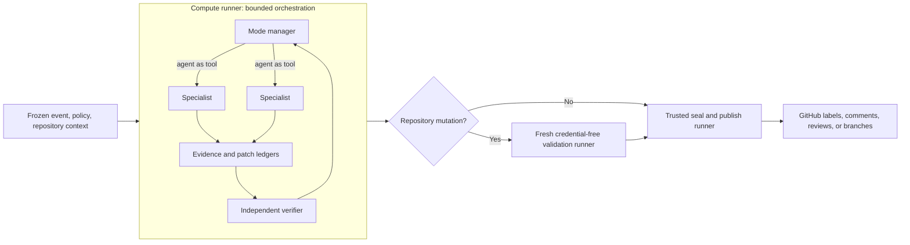
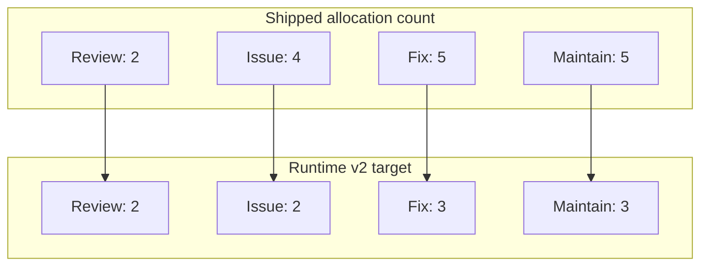
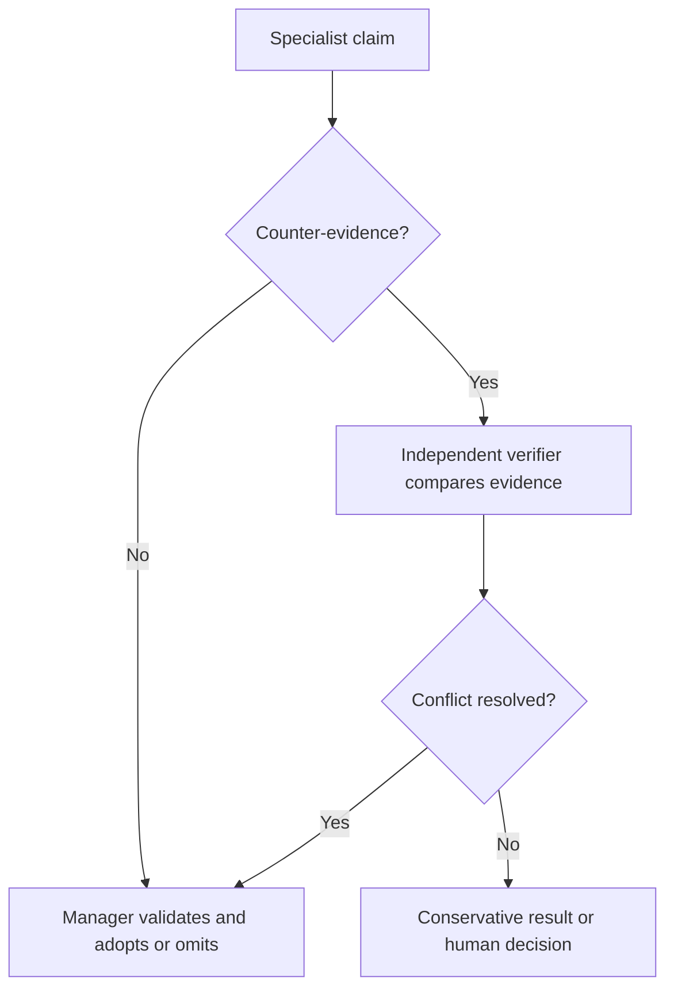
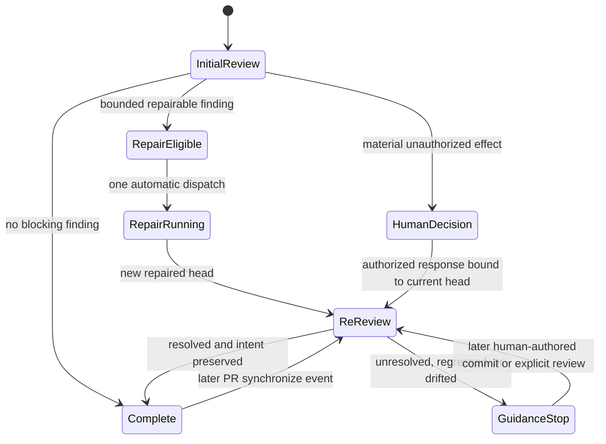
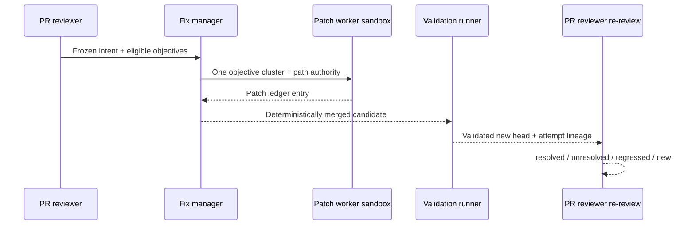

# Multi-agent orchestration specification

- **Status:** proposed
- **Audience:** Codekeeper runtime, workflow, policy, and evaluation maintainers
- **Scope:** pull-request review and repair, issue triage, and repository
  maintenance

This specification defines how Codekeeper should use the OpenAI Agents SDK for
bounded multi-agent work without weakening its deterministic security,
validation, or publication boundaries. It turns the current specialist-to-
coordinator flow into a manager-led orchestration kernel, assigns one semantic
owner to every GitHub object, and makes repair re-review, drift detection,
loop prevention, and human decisions explicit contracts.

The words **MUST**, **MUST NOT**, **SHOULD**, and **MAY** are normative.

## Decision summary



| Decision               | Contract                                                                                                                                                     |
| ---------------------- | ------------------------------------------------------------------------------------------------------------------------------------------------------------ |
| Agent topology         | A mode manager invokes narrow specialists as tools and retains control of the final result. Normal orchestration does not transfer control through handoffs. |
| Security boundary      | Agents are untrusted compute. Deterministic code owns frozen inputs, authorization, schemas, validation, sealing, credentials, and publication.              |
| Runner model           | Subagents execute inside the compute allocation. Codekeeper does not create a GitHub Actions matrix or a runner per subagent.                                |
| Pull-request ownership | The PR reviewer is the sole semantic owner of PR findings, re-review, merge recommendation, and PR labels.                                                   |
| Issue ownership        | The issue triager is the sole semantic owner of issue classification, priority, readiness, duplicate state, and issue labels.                                |
| Repair ownership       | The fixer may propose a bounded patch but cannot label a PR, resolve its own finding, declare success, or waive a human decision.                            |
| Loop policy            | One automatic repair round is allowed for a PR lineage by default. An unresolved repair produces guidance and stops.                                         |
| Human authority        | A material effect not explicitly authorized by the frozen PR intent requires a human decision bound to the decision fingerprint and current head.            |

## 1. Goals

The architecture MUST:

1. use specialist agents where independent repository investigation improves
   evidence quality;
2. keep one manager responsible for adjudication and one semantic owner for
   every published object;
3. let the PR reviewer act as the initial reviewer, repair re-reviewer, and
   ongoing head reviewer;
4. prevent agents from repeatedly repairing small findings until the pull
   request drifts from its original purpose;
5. stop for a human decision when a proposed outcome materially changes
   purpose, behavior, security, data, operations, or a meaningful trade-off;
6. preserve the existing exact-package, exact-head, credential separation,
   deterministic validation, sealing, and trusted-publication boundaries;
7. keep specialist fan-out conditional and bounded so simple tasks remain
   cheap; and
8. make routing, evidence, conflicts, repair attempts, and stopping decisions
   observable and evaluable.

## 2. Non-goals

This design does not introduce:

- one GitHub runner or matrix job per subagent;
- an agent, manager, handoff, prompt, or model judgment as a security boundary;
- direct GitHub mutation, label application, credential access, or publication
  by a model tool;
- persistent untrusted model memory shared between runs;
- unlimited or model-controlled repair loops;
- speculative refactoring outside the frozen task and path authority;
- multiple agents independently reconciling labels for the same object;
- automatic approval of a material change merely because a specialist calls it
  low risk; or
- a requirement to use every available specialist on every run.

## 3. Current and target topology

### 3.1 Current implementation snapshot

At the time of this specification, Codekeeper pins `@openai/agents` 0.16.0 and
uses it through one configured `Agent` and one `Runner` for the coordinator.
The coordinator has no tools or handoffs and policy fixes it to `maxTurns: 1`.
Workspace work uses the Codex CLI through local MCP. Fix mode can split at most
two repair clusters, but runs those workspace passes sequentially against one
checkout and merges their structured results afterward.

The shipped workflow graph is:

```text
review:   analyze -> gate
issue:    workspace -> analyze -> seal -> publish
fix:      workspace -> analyze -> verify -> seal -> publish
maintain: workspace -> analyze -> verify -> seal -> publish
```

This is a safe staged pipeline, but it is not yet a general multi-agent
orchestrator. The proposed kernel lives inside compute; it does not replace the
outer trust pipeline.

### 3.2 Target runner allocations



| Mode                      | Shipped allocations | Target allocations | Target shape                                                                        |
| ------------------------- | ------------------: | -----------------: | ----------------------------------------------------------------------------------- |
| Pull-request review       |                   2 |                  2 | compute; trusted seal/publish/gate                                                  |
| Issue triage              |                   4 |                  2 | compute; trusted seal/publish                                                       |
| Pull-request or issue fix |                   5 |                  3 | compute; fresh credential-free validation; trusted seal/publish                     |
| Repository maintenance    |                   5 |                  3 | compute; fresh credential-free validation when a patch exists; trusted seal/publish |

The orchestration kernel adds **zero** runner allocations to these target
shapes. A subagent is an in-process logical worker inside compute, not an Actions
job. Peak runner concurrency for one Codekeeper run remains one because the
outer stages remain sequential.

## 4. Trust and authority model

The immutable outer contract remains:

```text
frozen task and default-branch policy
        -> untrusted model compute
        -> deterministic schema and authority checks
        -> fresh credential-free repository validation when required
        -> sealed digest-bound candidate
        -> trusted short-lived credential publication
```

The orchestration kernel MUST NOT receive the GitHub App private key or token.
Specialists MUST receive only the minimum read or write surface required for
their role. The trusted publisher MUST derive the exact permitted GitHub
mutations from a validated, sealed result; it MUST NOT execute model-selected
GitHub calls.

The following components remain deterministic security controls:

- default-branch policy selection and validation;
- exact package and source identity verification;
- frozen PR head, base, task, intent, and context digests;
- tool allowlists and filesystem boundaries;
- structured-output validation and evidence-reference checks;
- repair scope, path, byte, file, and attempt limits;
- patch application and repository validation;
- candidate sealing and cross-run artifact verification;
- current-state rechecks immediately before mutation; and
- exact label reconciliation and publication adapters.

## 5. Orchestration kernel

### 5.1 Manager pattern

Each mode has one manager agent. The manager MAY invoke registered specialists
with the Agents SDK agent-as-tool pattern, but it MUST retain control of the
final response. Control-transfer handoffs are reserved for a future workflow
whose public contract genuinely changes after delegation; they are not the
normal Codekeeper composition mechanism.

The SDK implementation SHOULD expose specialists through `agent.asTool()` or
an equivalent typed wrapper. Each tool description MUST state:

- the narrow question it can answer;
- the evidence it must return;
- the files, commands, and context it may access;
- whether it is read-only or patch-producing;
- its output schema and maximum output size; and
- the conditions under which it must return uncertainty.

The manager MUST NOT ask two specialists to own the same semantic decision. It
may ask multiple specialists for evidence about the same risk, then adjudicate
their claims under the conflict rules below.

### 5.2 Validated orchestration plan

Before model execution, deterministic routing builds a bounded plan:

```json
{
  "mode": "review",
  "manager": "pr-review-manager",
  "specialists": ["correctness", "test-coverage"],
  "maximumSpecialists": 4,
  "maximumConcurrency": 3,
  "maximumToolCalls": 6,
  "maximumRepairRounds": 1,
  "deadlineMs": 900000,
  "scopeDigest": "sha256:..."
}
```

The policy validator MUST bound every numeric value and reject unknown roles.
The runtime MUST clamp provider/model configuration to these policy limits.
The manager may choose fewer specialists than the plan permits; it may not add
an unregistered specialist, expand its tools, or exceed the plan.

When orchestration is enabled, policy MUST allow a bounded manager turn count
large enough to request and consume tool results. The current `maxTurns: 1`
constraint remains the compatibility default for modes without specialist
tools, but cannot remain the orchestration ceiling. The scheduler, rather than
the model, owns the new upper bound.

### 5.3 Specialist registry

| Specialist class          | Typical role                                                            | Default authority         |
| ------------------------- | ----------------------------------------------------------------------- | ------------------------- |
| Correctness               | Trace changed behavior, invariants, and failure paths                   | Read-only                 |
| Tests                     | Locate affected public paths and evaluate meaningful coverage           | Read-only                 |
| Security                  | Inspect trust boundaries, authorization, injection, and secret exposure | Read-only                 |
| Performance or subsystem  | Investigate a routed high-risk subsystem                                | Read-only                 |
| Duplicate investigator    | Compare an issue against bounded open issue and PR context              | Read-only                 |
| Reproduction investigator | Find concrete reproduction evidence and missing inputs                  | Read-only                 |
| Scope and priority        | Evaluate issue impact, urgency, and implementation boundary             | Read-only                 |
| Patch worker              | Produce one authorized patch for one objective cluster                  | Isolated writer           |
| Verifier                  | Challenge claims, compare patch to intent, and assess resolution        | Read-only and independent |

Simple tasks SHOULD use only the manager. Fan-out occurs only when deterministic
routing or the manager identifies independent questions whose expected value
justifies the cost.

### 5.4 Isolation

Read-only specialists MAY share one frozen read-only repository snapshot. Each
patch-producing specialist MUST receive its own isolated writable sandbox or
worktree derived from the same exact head. Patch workers MUST NOT see or mutate
another worker's checkout.

Every sandbox MUST have:

- one exact source commit and scope digest;
- an explicit path allowlist;
- bounded writable directories;
- a command allowlist or repository validation facade;
- no App, provider, trace, or publication credential beyond the credential
  strictly needed by that model invocation;
- bounded wall time, output, child processes, and patch size; and
- teardown that terminates owned processes and rejects symlinked or irregular
  outputs.

If the SDK sandbox-agent surface is used, Codekeeper's deterministic wrapper
remains responsible for enforcing these constraints. SDK isolation is a
composition mechanism, not sufficient proof of Codekeeper's trust boundary.
Provider and trace keys remain in the trusted orchestration host and MUST NOT be
inherited by sandbox commands or child processes. A model may use a provider
through the host without receiving the raw credential in its filesystem,
prompt, tool arguments, or command environment.

### 5.5 Evidence ledger

Specialists return immutable claims rather than final labels or mutations. Each
claim records:

```json
{
  "claimId": "claim-...",
  "agentRole": "correctness",
  "kind": "finding",
  "statement": "...",
  "repositoryRef": {
    "headSha": "...",
    "path": "src/example.mjs",
    "startLine": 42,
    "endLine": 47
  },
  "evidenceRefs": ["bundle:file:...", "command:..."],
  "confidence": "high",
  "scopeDigest": "sha256:..."
}
```

The ledger MUST reject claims that refer to another head, an unavailable file,
an unauthorized command, or evidence absent from the frozen bundle. Managers
may omit a claim or choose a more conservative outcome, but MUST NOT invent
evidence or rewrite a specialist claim into a materially different assertion.
In a manager-only run, the manager may add its own claim to the same ledger only
when it cites frozen repository evidence under the identical validation rules.

### 5.6 Patch ledger and merge

Every patch worker returns a patch entry bound to one repair objective:

```json
{
  "patchId": "patch-...",
  "objectiveId": "finding-...",
  "baseHeadSha": "...",
  "allowedPaths": ["src/example.mjs", "test/example.test.mjs"],
  "changedPaths": ["src/example.mjs", "test/example.test.mjs"],
  "patchSha256": "...",
  "testsAttempted": [],
  "scopeDigest": "sha256:..."
}
```

Deterministic code MUST validate and merge patches in a stable order. It MUST
reject path escapes, symlinks, binary or oversized changes outside policy,
overlapping incompatible hunks, and modifications not authorized by the
objective. An explicitly related test path MAY be authorized even when the
finding points to a production path.

The manager cannot resolve merge conflicts by broadening scope. A conflict is
returned to the verifier or stops the repair.

### 5.7 Conflict adjudication

Specialist claims are evidence; the mode manager owns the semantic outcome.



A later agent MUST NOT silently overwrite an earlier claim. It adds
counter-evidence linked to the original claim. If the verifier cannot resolve a
material conflict, the manager MUST choose the conservative non-mutating state
or request a human decision.

### 5.8 Budgets and stopping

The scheduler MUST enforce:

- maximum specialists and simultaneous specialist calls;
- maximum model turns and tool calls per role;
- per-agent and total token/output budgets when usage is available;
- per-agent and whole-run deadlines;
- provider retry limits separated from repair rounds;
- patch file, byte, line, and diff-growth limits;
- one automatic repair round per PR lineage by default; and
- stop-before-expansion behavior when a task would cross its intent, path,
  effect, permission, or cost boundary.

Provider retries may repeat the same frozen call after a retryable transport or
schema failure. They MUST NOT be counted as permission to try a different
implementation. A repair round is a semantic patch attempt and is tracked
separately.

## 6. Pull-request review lifecycle

### 6.1 One reviewer, multiple phases

The PR reviewer is not a one-shot agent. It owns a living review across heads:



The same semantic owner performs:

1. **Initial review** of the frozen original comparison.
2. **Repair re-review** of the finding lineage against the repaired head.
3. **Ongoing head review** when a later `synchronize` event changes the PR.

Review specialists remain evidence-only. They never apply labels, publish
comments, resolve threads, or dispatch repair.

### 6.2 Frozen PR intent contract

Before the first review or repair, deterministic preparation MUST freeze an
intent contract from trusted and bounded context:

```json
{
  "goal": "...",
  "acceptanceCriteria": ["..."],
  "explicitDecisions": ["..."],
  "nonGoals": ["..."],
  "authorizedPaths": ["..."],
  "authorizedEffects": ["..."],
  "originalBaseSha": "...",
  "originalHeadSha": "...",
  "sourceRefs": ["pr-body", "linked-issue", "accepted-thread"],
  "intentDigest": "sha256:..."
}
```

Repository context SHOULD include applicable `AGENTS.md`, architecture and
decision records, tests, surrounding code, the linked issue, PR body, accepted
maintainer discussions, and the original diff. Untrusted text remains evidence,
not authority.

The intent contract MUST NOT be regenerated from a fixer-authored commit or
model summary. A human may amend it only through an authorized response bound
to the current decision and head.

### 6.3 Stable finding lineage

Every review finding MUST have a stable identifier derived from its normalized
root cause, owning path, behavior, and original intent digest. Titles and line
movement alone MUST NOT create a new finding. Each review records:

- `findingId` and deterministic fingerprint;
- first-seen and current head SHA;
- prior comment or thread identifiers;
- repair objective and attempt identifiers, if any;
- current status; and
- evidence added or retired at the current head.

The existing generic finding fingerprint may seed this design, but production
review must persist the lineage in App-owned, digest-bound state rather than use
an audit-only marker implicitly.

### 6.4 Re-review contract

For each prior finding affected by a new head, re-review returns:

```json
{
  "findingId": "finding-...",
  "findingStatus": "unresolved",
  "intentPreserved": "yes",
  "scopeDrift": "none",
  "automaticRepairAllowed": false,
  "guidance": {
    "whatChanged": "...",
    "whyStillBroken": "...",
    "remainingBehavior": "...",
    "suggestedCorrection": "...",
    "requiredValidation": "..."
  }
}
```

Allowed finding states are `resolved`, `unresolved`, `regressed`, and `new`.
Allowed intent states are `yes`, `no`, and `uncertain`. Scope drift is `none`,
`justified`, or `unjustified`.

After an automatic repair, `automaticRepairAllowed` MUST be `false`. If the
finding is unresolved, regressed, intent-changing, or uncertain, the reviewer
replies to the original thread or finding comment with focused guidance, keeps
the PR in a non-merge-ready state, and stops. It MUST NOT dispatch another
automatic repair.

If resolved, the reviewer may resolve the App-owned finding/thread, update the
living summary, and reconcile PR labels. The fixer itself never performs those
actions.

### 6.5 PR label ownership

The PR reviewer is the sole semantic owner of PR labels such as:

- `merge-ready`;
- `changes-required`;
- `review-needed`;
- configured risk or review-category labels; and
- any other label derived from the final review result.

Only the trusted PR publication adapter writes the exact reconciled label set.
The manager returns semantics; specialists and fixers return evidence and
patches.

## 7. Human decision gate

### 7.1 Trigger rule

A human decision is required when both are true:

1. the proposed review, repair, or merge outcome has a material effect; and
2. that effect is not explicitly authorized by the frozen PR intent.

Material effects include:

- changing the PR purpose, acceptance criteria, or declared non-goals;
- changing public behavior, API, compatibility, or supported platforms;
- data migration, deletion, corruption risk, or another irreversible effect;
- authentication, authorization, privacy, security, or permission changes;
- deployment, release, operational, or infrastructure changes;
- meaningful cost, performance, availability, or reliability trade-offs; and
- removing or rewriting behavior that repository context indicates is
  intentional.

### 7.2 Structured decision

The review schema MUST add a decision object equivalent in rigor to issue
triage:

```json
{
  "required": true,
  "category": "behavior-change",
  "question": "Should this PR change the documented retry behavior?",
  "rationale": "The proposed fix changes a public failure contract not authorized by the PR intent.",
  "evidenceRefs": ["claim-..."],
  "options": [
    {
      "label": "Preserve behavior",
      "description": "Fix the defect without changing the public retry contract.",
      "recommended": true
    },
    {
      "label": "Change behavior",
      "description": "Amend the PR purpose and compatibility notes first.",
      "recommended": false
    }
  ]
}
```

Allowed categories are `purpose-change`, `behavior-change`, `security`, `data`,
`operations`, and `tradeoff`. A required decision MUST contain one focused
question, supporting rationale and evidence, at least two useful options when
there is a real choice, and exactly one recommendation.

When `decision.required` is true, deterministic validation MUST require:

- `mergeRecommendation: "manual"`;
- `automaticRepair.eligible: false`;
- auto-merge disabled;
- the reviewer-owned `review-needed` label;
- no `merge-ready` or `changes-required` label inferred solely from a proposed
  automated fix; and
- one focused App-owned decision comment rather than repeated reminders.

No manager, specialist, fixer, or verifier may waive the decision. An
authorized human response MUST be frozen with the decision fingerprint, author
authority, response content, and current PR head. A changed head or materially
changed question invalidates the response and requires re-review.

### 7.3 Repair eligibility correction

Repair eligibility MUST explicitly reject a review result with a required
decision or `mergeRecommendation: "manual"`. It is not sufficient to infer
ineligibility only from blocking findings or feedback disposition.

## 8. Fixer orchestration

### 8.1 Role separation

The PR reviewer decides whether a finding is eligible for automatic repair and
creates bounded repair objectives. The fixer manager plans implementation; one
or more isolated patch workers implement disjoint objective clusters; the
deterministic runtime merges and validates their patches; the PR reviewer then
re-reviews the new head.



### 8.2 Repair limits

The default automatic policy is:

- at most one automatic repair round for the PR lineage;
- at most two patch workers initially, matching the current cluster cap;
- disjoint authorized objective and path scopes;
- one deterministic merge of all accepted patches;
- one fresh credential-free repository validation stage; and
- one mandatory reviewer re-review after the repaired head is published.

The attempt ledger MUST survive reruns and duplicate events through App-owned,
digest-bound state. A provider retry, workflow retry, or stale publication MUST
not accidentally grant a second semantic repair round.

An optional second repair round MAY be introduced later only behind an explicit
policy opt-in and owner action. It is outside the default architecture and must
have separate evaluation evidence.

### 8.3 Fixer output boundary

The fixer may return changed paths, patch bytes, implementation summary, tests
attempted, and unresolved constraints. It MUST NOT return or control:

- PR semantic labels;
- merge recommendation;
- finding resolution status;
- thread resolution;
- auto-merge eligibility;
- human-decision waiver; or
- GitHub mutation instructions.

## 9. Issue triage orchestration

### 9.1 Manager and specialists

The issue triager remains the sole semantic owner of an issue. It MAY invoke:

- a duplicate investigator;
- a reproduction and evidence investigator;
- a scope and priority investigator; and
- an implementation-readiness investigator.

All issue specialists are read-only. Simple issues should be handled by the
manager alone. An issue agent never edits the repository. If the final triage
is `ai-ready` and policy permits implementation, deterministic publication
dispatches a separate fix pipeline.

### 9.2 Issue label ownership

The issue triager owns issue semantic labels, including:

- issue type;
- priority;
- duplicate status;
- needs-information or actionable state; and
- implementation readiness.

The issue publisher derives the desired labels from the validated final triage
result and reconciles them exactly. Pull requests MUST remain excluded from the
issue inventory and issue-label path.

### 9.3 Deferred review findings

A PR reviewer may create or update a deferred issue because it owns the source
finding and its provenance. It does not thereby become the semantic owner of
the issue.

The creation seam MUST separate:

- **review-owned provenance:** source PR, finding fingerprint, evidence, and
  App marker;
- **runtime-owned lifecycle:** deferred or paused state; and
- **triager-owned semantics:** type, priority, duplicate state, readiness, and
  other managed issue labels.

Reviewer reruns MUST NOT overwrite triager-owned issue labels. After creation,
the issue enters normal issue triage. Closing or retiring the source finding
must preserve this ownership split.

## 10. Repository maintenance orchestration

Maintenance uses a repository-audit manager with conditional read-only
specialists divided by subsystem or trust boundary. Examples include runtime,
workflow, installer, release provenance, security, and test-contract auditors.

The manager deduplicates findings, selects any repair candidate, and invokes an
independent verifier before publication. If policy authorizes a repair, it uses
the same isolated patch-worker, deterministic merge, fresh validation, and
attempt-ledger contracts as fix mode.

Maintenance specialists do not create GitHub issues or labels directly. The
trusted publisher owns those mutations from the manager's validated result.

## 11. Ownership matrix

| Object or decision              | Semantic owner                        | Evidence contributors          | Deterministic writer               |
| ------------------------------- | ------------------------------------- | ------------------------------ | ---------------------------------- |
| PR findings and status          | PR reviewer                           | Review specialists, verifier   | PR publisher                       |
| PR semantic labels              | PR reviewer                           | None directly                  | PR publisher                       |
| Repair eligibility              | PR reviewer plus deterministic policy | Review specialists             | Repair dispatcher                  |
| Repair patch                    | Fix manager                           | Isolated patch workers         | Patch merger and validation runner |
| Finding resolution              | PR reviewer during re-review          | Verifier and tests             | PR publisher                       |
| Human-decision requirement      | PR reviewer, fail-closed by schema    | Specialists and verifier       | PR publisher                       |
| Issue classification and labels | Issue triager                         | Issue specialists              | Issue publisher                    |
| Deferred finding provenance     | PR reviewer                           | Review specialists             | Deferred-issue publisher           |
| Deferred issue semantics        | Issue triager                         | Issue specialists              | Issue publisher                    |
| Lifecycle labels                | Deterministic runtime                 | Validated run state            | Mode publisher                     |
| Maintenance finding             | Audit manager                         | Audit specialists and verifier | Maintenance publisher              |

An agent output never grants mutation authority. The final writer accepts only
the fields owned by its mode and ignores or rejects foreign ownership claims.

## 12. Label reconciliation contract

Codekeeper label namespaces MUST be partitioned:

1. **PR semantic labels** are derived only from the final PR reviewer result.
2. **Issue semantic labels** are derived only from the final issue triage result.
3. **Lifecycle labels** such as deferred, paused, or repair state are derived
   only from deterministic runtime state.
4. **Human-owned or unmanaged labels** are preserved.

The publisher MUST use an explicit ownership map rather than a shared pool of
labels. A label in one ownership class cannot be removed by another class. All
model-proposed label values remain constrained by configured allowlists.

## 13. Run and repair state machines

The outer envelope stays monotonic:

```text
created
  -> compute-complete
  -> validation-complete | validation-not-required
  -> sealed
  -> published
```

The PR lineage adds a bounded semantic state machine:

```text
unreviewed
  -> reviewed-clean | reviewed-blocked | awaiting-human
  -> repair-dispatched
  -> repair-validated
  -> rereview-resolved | rereview-unresolved | rereview-regressed
  -> stopped
```

No retry may skip an outer state. No automatic transition may leave
`awaiting-human`. No state after `repair-dispatched` may transition back to
automatic repair under the default policy.

## 14. Configuration and compatibility

The first implementation SHOULD be conservative and feature-flagged. Suggested
policy shape:

```json
{
  "ai": {
    "orchestration": {
      "enabled": false,
      "maximumSpecialists": 4,
      "maximumConcurrency": 3,
      "maximumToolCalls": 6,
      "maximumAutomaticRepairRounds": 1,
      "providerMultiAgent": false
    }
  }
}
```

Defaults MUST preserve the current single-manager behavior until the relevant
mode is enabled. Existing installations remain pinned to their current package
and workflow receipt until an update PR merges.

The OpenAI Responses API multi-agent capability MAY be evaluated behind
`providerMultiAgent`. It MUST preserve the same specialist registry, budgets,
traces, schemas, sandboxes, and deterministic boundaries. Provider-side
orchestration cannot become required for other providers or become the sole
enforcement mechanism.

## 15. Observability and evaluation

Every run SHOULD record a redacted orchestration receipt containing:

- run, task, context, policy, and head digests;
- manager role and selected model tier;
- specialist roles requested, skipped, completed, timed out, or failed;
- parent/child trace identifiers;
- tool-call and timing counts;
- claim, counter-claim, decision, patch, and repair-attempt identifiers;
- scheduler stop reason;
- token and cost metadata when the provider reports it; and
- final schema, validation, seal, and publication outcomes.

Receipts MUST NOT contain secrets, raw credentials, hidden prompts, unrestricted
tool output, or unbounded repository content. Sensitive trace export remains
off by default.

Evaluation coverage MUST include:

| Evaluation           | Required proof                                                                                        |
| -------------------- | ----------------------------------------------------------------------------------------------------- |
| Specialist routing   | Simple cases avoid fan-out; high-value cases select the intended narrow roles.                        |
| Review quality       | Specialists improve or preserve recall without increasing unsupported findings.                       |
| Conflicting evidence | Counter-evidence is linked, independently verified, and conservatively adjudicated.                   |
| Failed repair        | Re-review marks the finding unresolved or regressed and publishes useful guidance without redispatch. |
| Intent preservation  | A technically valid but purpose-changing patch is stopped.                                            |
| Human gate           | Material unauthorized effects produce exactly one bound decision and disable repair and auto-merge.   |
| Loop prevention      | Duplicate events, reruns, and changed heads cannot grant another default repair round.                |
| Label ownership      | PR review cannot overwrite triager labels and issue triage cannot overwrite PR labels.                |
| Deferred issue seam  | Reviewer provenance survives while triager semantics remain authoritative.                            |
| Sandbox isolation    | Patch workers cannot modify each other's checkout or escape authorized paths.                         |
| Runner topology      | Subagent fan-out does not add Actions jobs or increase peak runner concurrency.                       |
| Exact-head safety    | Stale claims, patches, decisions, candidates, and publications fail closed.                           |

Trace grading SHOULD assess tool choice, specialist routing, evidence grounding,
instruction violations, unnecessary fan-out, and stopping behavior. Datasets
and answer keys must remain private and human-gated; they MUST NOT be written
into adopter repositories or exposed to runtime agents.

## 16. Rollout plan

### Phase A — contracts and ownership

- Add the orchestration plan, evidence ledger, patch ledger, PR intent, finding
  lineage, decision, and repair-attempt schemas.
- Partition PR, issue, deferred, and lifecycle label ownership.
- Make repair eligibility explicitly reject manual or human-decision states.
- Add deterministic contract tests before enabling any subagent.

### Phase B — reviewer manager

- Convert the PR coordinator into a manager with conditional read-only
  specialists.
- Implement stable finding lineage and head-aware re-review.
- Add human-decision publication and the one-round stopping contract.
- Keep existing two-runner review topology.

### Phase C — isolated fixer workers

- Replace sequential shared-checkout repair clusters with isolated patch
  workers invoked as tools.
- Add deterministic patch-ledger merge and conflict rejection.
- Bind the repaired head to the originating finding and attempt.
- Require reviewer re-review before findings or labels can be cleared.

### Phase D — issue triage and deferred seam

- Add conditional read-only issue specialists.
- Consolidate issue compute while preserving trusted publication.
- Move all issue semantic label decisions to the issue triager.
- Separate deferred provenance and lifecycle from triager-owned semantics.

### Phase E — maintenance specialists

- Add bounded subsystem and trust-boundary audit specialists.
- Reuse the verifier and isolated repair contracts.
- Consolidate the outer workflow to the Runtime v2 three-allocation repair
  shape.

### Phase F — provider-side multi-agent experiment

- Evaluate the Responses API multi-agent capability behind a provider flag.
- Compare correctness, latency, token use, trace quality, and stopping behavior
  against local Agents SDK orchestration.
- Promote it only if all deterministic contracts remain provider-independent.

Each phase requires offline contract tests, exact-candidate verification, and
authorized live adopter evidence appropriate to the changed boundary. A later
phase is not required to ship an earlier independently useful phase.

## 17. Implementation seams

The first implementation is expected to touch these canonical areas:

| Concern                 | Current seam                                           | Required change                                                                                                                                        |
| ----------------------- | ------------------------------------------------------ | ------------------------------------------------------------------------------------------------------------------------------------------------------ |
| Agents SDK manager      | `tools/codekeeper/src/lib/agents-runtime-provider.mjs` | Register typed specialist tools, scheduler budgets, and manager traces.                                                                                |
| Workspace orchestration | `tools/codekeeper/src/lib/agents-runtime-core.mjs`     | Replace shared sequential fixer passes with isolated worker execution and ledgers.                                                                     |
| Policy                  | `tools/codekeeper/src/lib/policy-validator.mjs`        | Add closed orchestration configuration and bounds; replace the one-turn ceiling only for enabled manager tools while preserving conservative defaults. |
| Schemas                 | `tools/codekeeper/src/lib/schemas.mjs`                 | Add intent, finding lineage, re-review, decision, evidence, patch, and attempt contracts.                                                              |
| Repair objectives       | `tools/codekeeper/src/lib/repair-objectives.mjs`       | Bind clusters to stable finding IDs, intent digest, path authority, and attempt state.                                                                 |
| PR publication          | `tools/codekeeper/src/lib/publish/review.mjs`          | Enforce reviewer ownership, human gate, re-review, one-round repair, and PR labels.                                                                    |
| Issue publication       | `tools/codekeeper/src/lib/publish/issue.mjs`           | Keep issue semantic reconciliation exclusively triager-owned.                                                                                          |
| Deferred publication    | `tools/codekeeper/src/lib/publish/review.mjs`          | Split review provenance and lifecycle from triager-owned issue semantics.                                                                              |
| GitHub markers          | `tools/codekeeper/src/lib/markers.mjs`                 | Add stable review-lineage, decision, and repair-attempt fingerprints.                                                                                  |
| Workflows               | reusable runtime workflows and workflow contract tests | Consolidate target allocations without changing credential placement or publication authority.                                                         |
| Evaluations             | `tools/codekeeper` eval harness and private live suite | Add routing, conflict, drift, loop, ownership, and human-gate cases.                                                                                   |

This table is an impact map, not a requirement to implement the design as one
large pull request. Each rollout phase should remain independently reviewable
and below the repository's changed-line limit.

## 18. Acceptance criteria

The architecture is complete only when all applicable criteria have automated
or live boundary evidence:

1. A simple PR or issue can complete with the manager alone.
2. A routed complex case invokes only registered, narrow specialists within the
   configured concurrency, turn, call, time, and output budgets.
3. Specialist fan-out creates no additional GitHub Actions jobs and does not
   increase peak runner concurrency.
4. Writer specialists operate from the same exact head in isolated writable
   sandboxes and cannot modify another worker's checkout.
5. Deterministic merge rejects unauthorized paths, incompatible overlapping
   patches, irregular files, and stale base heads.
6. Review, fix, issue, and maintenance candidates remain bound to exact policy,
   package, repository, context, and head digests.
7. The PR reviewer alone determines PR semantic labels, merge recommendation,
   finding resolution, and re-review guidance.
8. The issue triager alone determines issue type, priority, duplicate,
   actionable, readiness, and semantic labels.
9. A reviewer-created deferred issue preserves source provenance but cannot
   overwrite triager-owned semantic labels on a rerun.
10. A successful repair is not marked resolved until the reviewer re-reviews
    the new head and verifies the original finding behavior.
11. A failed or regressed repair replies with concrete guidance, keeps the PR
    non-merge-ready, and dispatches no second automatic repair.
12. Duplicate events, provider retries, workflow retries, and new review runs
    cannot bypass the one-round repair ledger.
13. A material effect outside the frozen intent produces one human decision,
    sets manual review, disables repair and auto-merge, and waits for an
    authorized response bound to the current head.
14. No agent or specialist can waive a human decision, mutate GitHub, mint an
    App token, or alter deterministic validation.
15. Unresolved specialist conflict results in independent verification,
    conservative publication, or a human decision rather than silent
    overwriting.
16. Review remains two allocations; target issue becomes two; target fix and
    maintenance become three, with fresh credential-free validation retained
    for repository mutation.
17. Every changed runtime, workflow, package, and publication boundary passes
    the repository release-safety impact map and is proven at the exact final
    commit.

## 19. Authoritative SDK references

The composition choices in this specification follow OpenAI's current guidance:

- [Agent orchestration](https://developers.openai.com/api/docs/guides/agents/orchestration)
  distinguishes manager-owned agents-as-tools from control-transfer handoffs.
- [Sandbox agents](https://developers.openai.com/api/docs/guides/agents/sandboxes)
  describes isolated agent filesystem and command environments.
- [Agent evaluations](https://developers.openai.com/api/docs/guides/agent-evals)
  describes trace grading and dataset-backed evaluation of tool and handoff
  behavior.
- [Latest model guidance](https://developers.openai.com/api/docs/guides/latest-model)
  recommends explicit autonomy, tool, concurrency, retry, and stopping limits
  for multi-agent workflows.

These SDK facilities support orchestration. Codekeeper's deterministic runtime
and fresh-runner boundaries remain the authority and security controls.
