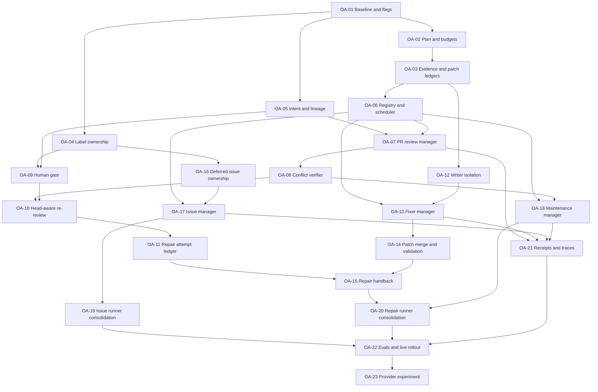

# Multi-agent orchestration implementation backlog

- **Status:** proposed
- **Audience:** Codekeeper runtime, workflow, policy, publication, and evaluation maintainers
- **Source specification:** [Multi-agent orchestration specification](MULTI_AGENT_ORCHESTRATION_SPEC.md)
- **Delivery unit:** one task normally equals one pull request

This backlog converts the approved architecture into independently reviewable
implementation tasks. It preserves the specification's semantic ownership,
exact-head evidence, deterministic validation, stopping, and credential
boundaries. It does not authorize GitHub issue creation or implementation by
itself.

## Delivery rules

Every task MUST:

- remain below 3,000 changed lines and split again before exceeding that limit;
- preserve unrelated work and the current exact package, policy, and source
  identity contracts;
- add observable-behavior tests before enabling new authority;
- default new orchestration behavior off until its delivery gate is complete;
- keep model output untrusted and GitHub mutation deterministic;
- record exact commands, results, commit SHA, and unverified live boundaries;
  and
- follow [Agent change and release safety](AGENT_RELEASE_SAFETY.md), including
  generated-tooling, package, and final source-manifest sequencing.

Unless a task says otherwise, its verification floor is:

```text
focused node:test files for the changed behavior
cd tools/codekeeper && npm run check
root npm run check
affected package and workflow contract checks
final clean source-manifest refresh and source verification
```

Runtime payload changes also require the tooling manifest sequence. Changes to
mirrored label or policy helpers require the relevant synchronization check.
Workflow changes require source and packaged workflow contract tests.

## Task map



## Backlog summary

| ID    | Task                                                                | Size | Depends on                 | Safe parallel lane                           |
| ----- | ------------------------------------------------------------------- | ---- | -------------------------- | -------------------------------------------- |
| OA-01 | Freeze baseline and add disabled orchestration flags                | M    | —                          | Foundation only                              |
| OA-02 | Add orchestration-plan and budget contracts                         | M    | OA-01                      | Labels and lineage                           |
| OA-03 | Add evidence and patch ledger contracts                             | M    | OA-02                      | Label ownership                              |
| OA-04 | Partition PR, issue, lifecycle, and unmanaged labels                | M    | OA-01                      | Plan and ledgers                             |
| OA-05 | Add frozen PR intent, finding, decision, and attempt lineage        | L    | OA-01                      | Plan and labels                              |
| OA-06 | Build the bounded specialist registry and scheduler                 | L    | OA-03                      | Writer isolation after OA-03                 |
| OA-07 | Convert PR review to a manager with initial specialists             | L    | OA-06, OA-05               | Writer isolation                             |
| OA-08 | Add counter-evidence and independent conflict verification          | M    | OA-07                      | Writer isolation                             |
| OA-09 | Enforce the human decision gate                                     | M    | OA-04, OA-05               | Scheduler before publication work            |
| OA-10 | Add head-aware finding re-review and guidance                       | L    | OA-08, OA-09               | Fixer isolation                              |
| OA-11 | Enforce one automatic repair round                                  | M    | OA-10                      | Fixer manager where files do not overlap     |
| OA-12 | Isolate patch-producing workers                                     | L    | OA-03                      | Reviewer lane                                |
| OA-13 | Convert fixer clusters into manager-owned agent tools               | L    | OA-06, OA-12               | Reviewer publication lane                    |
| OA-14 | Merge patch ledgers deterministically and preserve partial outcomes | L    | OA-13                      | Re-review lane where files do not overlap    |
| OA-15 | Bind repaired heads back to reviewer re-review                      | L    | OA-11, OA-14               | Issue lane                                   |
| OA-16 | Split deferred issue provenance from triager semantics              | M    | OA-04                      | Scheduler and writer isolation               |
| OA-17 | Convert issue triage to a manager with conditional specialists      | L    | OA-06, OA-16               | Maintenance manager                          |
| OA-18 | Convert maintenance to a manager with audit specialists             | L    | OA-06, OA-08               | Issue manager                                |
| OA-19 | Consolidate issue triage from four runners to two                   | L    | OA-17                      | Repair semantics                             |
| OA-20 | Consolidate fix and maintenance from five runners to three          | L    | OA-15, OA-18               | Issue topology                               |
| OA-21 | Seal redacted orchestration receipts and traces                     | M    | OA-07, OA-13, OA-17, OA-18 | Workflow topology where files do not overlap |
| OA-22 | Add orchestration evals and controlled live rollout gates           | L    | OA-19, OA-20, OA-21        | Final integration only                       |
| OA-23 | Evaluate provider-side multi-agent execution                        | M    | OA-22                      | Optional experiment                          |

Sizes are relative implementation risk, not calendar estimates. A large task
must still stay within one coherent root cause and the repository line limit.

## Gate A — contracts and ownership

Gate A must ship with orchestration disabled and no changed runtime behavior.
It creates the deterministic vocabulary every later task consumes.

### OA-01 — Freeze baseline and add disabled orchestration flags

**Outcome:** Current single-manager behavior and runner topology are captured,
and closed policy flags exist without enabling subagents.

**Primary surfaces:** `.github/codekeeper.json`, policy validation and
normalization, installer policy copy, mode planning, and topology fixtures.

**Work:**

- Add a closed `ai.orchestration` object with conservative limits and
  `enabled: false` by default.
- Keep `maxTurns: 1` for modes without enabled specialist tools.
- Record current model-call, repair-cluster, and runner-allocation baselines.
- Reject unknown roles, invalid budgets, and unsupported mode combinations.
- Keep existing adopter policies valid through normalization or an explicit
  versioned migration.

**Focused verification:** policy, config, installer policy-validator,
mode-plan, and workflow-topology tests; canonical policy-copy synchronization.

**Done when:** An unchanged installation produces the same plans and behavior,
and no subagent can run while the flag is false.

### OA-02 — Add orchestration-plan and budget contracts

**Outcome:** Deterministic code can create and validate one digest-bound plan
for a manager run.

**Primary surfaces:** a narrow orchestration plan module, schemas, mode-plan
preparation, artifact validation, and orchestration kernel tests.

**Work:**

- Define manager role, registered specialists, maximum concurrency, turns,
  calls, output, deadline, retry, and repair-round limits.
- Bind the plan to mode, policy, package, repository, context, and head digests.
- Canonicalize the plan before hashing and reject unknown or duplicate roles.
- Make provider settings subordinate to deterministic plan ceilings.
- Represent manager-only execution as a valid zero-specialist plan.

**Focused verification:** exact-key, bound, digest mutation, stale-context,
unknown-role, duplicate-role, and manager-only tests.

**Done when:** Every future manager run has an immutable validated plan before
the Agents SDK is called.

### OA-03 — Add evidence and patch ledger contracts

**Outcome:** Specialist claims and writer outputs use bounded exact-context
ledgers rather than free-form handoffs.

**Primary surfaces:** new evidence and patch ledger modules, schema validation,
artifact handoff, sealing, run envelopes, and validation tests.

**Work:**

- Define claims, counter-claims, evidence and repository references, patches,
  objectives, allowed paths, changed paths, and digests.
- Reject missing evidence, stale heads, unknown kinds, irregular files,
  oversized fields, path escapes, and scope mismatches.
- Preserve immutable claim identity when counter-evidence is added.
- Canonicalize and hash ledgers for candidate sealing.
- Allow manager-only claims only under identical evidence rules.

**Focused verification:** malformed ledger matrix, exact-head mutation, path
traversal, symlink, size, duplicate identity, and seal/reload round trips.

**Done when:** A manager cannot publish or repair from an unreferenced prose
claim or unbound patch.

### OA-04 — Partition label ownership

**Outcome:** PR review, issue triage, deterministic lifecycle state, and humans
have disjoint label authority.

**Primary surfaces:** canonical and mirrored label ownership helpers,
publication common helpers, PR publication, issue publication, and label tests.

**Work:**

- Replace the shared set with PR semantic, issue semantic, lifecycle,
  legacy-compatibility, and unmanaged classes.
- Add mode-specific managed-label reconciliation helpers.
- Split shared model label allowlists into mode-specific PR and issue inputs,
  with a compatibility migration for existing policy.
- Preserve human-owned labels and safe legacy cleanup behavior.
- Fail closed when one mode attempts to remove another mode's label.
- Keep all model-proposed values behind configured allowlists.

**Focused verification:** cross-mode removal, human-label preservation, legacy
migration, empty desired sets, idempotent reruns, and helper synchronization.

**Done when:** Only the PR publisher can reconcile PR semantic labels and only
the issue publisher can reconcile issue semantic labels.

### OA-05 — Add frozen PR intent and lineage contracts

**Outcome:** Review findings, decisions, and repair attempts stay bound to the
original purpose and exact heads.

**Primary surfaces:** PR preparation, repository context, schemas, markers,
candidate artifacts, review fixtures, and marker tests.

**Work:**

- Freeze bounded intent inputs from the PR, linked issue, accepted maintainer
  discussion, repository guidance, architecture context, tests, and original
  diff.
- Define goal, acceptance criteria, decisions, non-goals, authorized paths and
  effects, provenance, and intent digest.
- Define stable finding, decision, and repair-attempt identifiers with head
  lineage.
- Prevent fixer-authored commits or model summaries from replacing intent.
- Bind human answers to decision fingerprint, author authority, and current
  head.

**Focused verification:** title and line movement, root-cause change, head
change, intent-source change, forged marker, unauthorized author, and fixer-
regenerated-intent rejection.

**Done when:** A finding can be followed across heads without treating wording
or line movement as a new objective.

### Gate A acceptance

- Orchestration remains disabled by default.
- Current single-manager results and workflow topology remain unchanged.
- Plans, ledgers, label classes, intent, and lineage fail closed under malformed
  or stale input.
- Package, policy-copy, tooling-manifest, and source-manifest consumers are
  synchronized at the final commit.

## Gate B — reviewer manager and stopping decisions

Gate B makes PR review multi-agent while retaining two runner allocations and
exclusive reviewer ownership.

### OA-06 — Build the bounded specialist registry and scheduler

**Outcome:** A mode manager can invoke registered agents as tools within a
deterministic plan.

**Primary surfaces:** `agents-runtime-provider.mjs`, new registry and scheduler
modules, policy mapping, tracing hooks, and provider tests.

**Work:**

- Register typed specialists through `Agent.asTool()` or an equivalent wrapper.
- Give every role a narrow input, output, authority, and uncertainty contract.
- Enforce concurrency, turns, calls, time, retries, and output outside model
  control.
- Separate provider retries from semantic repair attempts.
- Keep manager-only and legacy one-turn fast paths when tools are off.
- Return bounded timeout, skipped, failed, and completed states per tool.

**Focused verification:** fake-agent routing, concurrency, timeout, retry,
cancellation, unknown role, budget breach, manager-only, and trace-parent tests.

**Done when:** The model can select fewer permitted specialists but cannot add
authority or exceed the frozen plan.

### OA-07 — Convert PR review to a manager with initial specialists

**Outcome:** The PR reviewer manages conditional read-only investigation and
remains the sole author of the final result.

**Primary surfaces:** review agent profile and schema, Agents SDK provider,
workspace review orchestration, prompts, evidence boundaries, and review evals.

**Work:**

- Start with correctness and test-coverage specialists.
- Add security and subsystem specialists only for deterministic high-risk routes
  after the initial roles pass their focused evaluation fixtures.
- Route simple reviews to the manager alone and independent questions to
  bounded parallel specialists.
- Keep specialists read-only and exclude labels, comments, repair, and merge
  fields from their schemas.
- Require every adopted finding to cite a validated ledger claim.
- Preserve current reasoning escalation until replacement evidence supports a
  different route.

**Focused verification:** no-fan-out, routed fan-out, unsupported claim,
specialist failure/timeout, duplicate finding, Medium/Max escalation, and
evidence-boundary tests.

**Done when:** Multiple investigators improve evidence without adding runners
or owning PR semantics.

### OA-08 — Add counter-evidence and conflict verification

**Outcome:** Disagreeing specialists cannot silently overwrite each other.

**Primary surfaces:** evidence ledger, reviewer manager, verifier tool/profile,
review schema, rendering metadata, and conflict evals.

**Work:**

- Link counter-claims to originals and preserve both records.
- Invoke an independent read-only verifier only for material conflicts.
- Compare evidence rather than voting on agent identity.
- Resolve to a supported claim, conservative non-mutation, or human decision.
- Keep unresolved conflict out of repair and auto-merge.

**Focused verification:** conflicting path, behavior, severity, and test claims;
verifier agreement, uncertainty, failure, and silent-overwrite rejection.

**Done when:** Every material conflict has a traceable adjudication or explicit
stop.

### OA-09 — Enforce the human decision gate

**Outcome:** Material effects outside frozen intent wait for an authorized
human and cannot be repaired or merged automatically.

**Primary surfaces:** review schema and validation, PR policy and publication,
rendering, markers, and publication tests.

**Work:**

- Add decision category, question, rationale, evidence, and options with exactly
  one recommendation.
- Require manual merge recommendation, review-needed state, disabled auto-merge,
  and ineligible repair.
- Explicitly reject repair for manual recommendations.
- Upsert one fingerprinted decision comment without repeated reminders.
- Revalidate author, answer, fingerprint, and head before resuming.

**Focused verification:** every material-effect category, unused shape,
multiple recommendations, manual-with-repair, head drift, unauthorized answer,
repeated event, and auto-merge suspension.

**Done when:** No agent can waive or route around a human decision.

### OA-10 — Add head-aware finding re-review and guidance

**Outcome:** The reviewer becomes initial reviewer, repair re-reviewer, and
ongoing head reviewer.

**Primary surfaces:** PR preparation, reviewer schema/profile, publication,
review feedback/thread APIs, markers, and synchronize-event tests.

**Work:**

- Compare stable findings against each relevant new head.
- Return resolved, unresolved, regressed, or new plus intent and scope drift.
- Reply to the original finding with what changed, why it still fails,
  correction guidance, and required validation.
- Resolve App-owned findings only after exact-head evidence proves resolution.
- Review later human commits without granting another repair round.

**Focused verification:** resolved, still broken, regression, line movement,
new finding, stale/outdated thread, synchronize event, and intent uncertainty.

**Done when:** A failed fix produces reviewer guidance instead of fixer-authored
success.

### OA-11 — Enforce one automatic repair round

**Outcome:** Duplicate events, retries, and later review runs cannot create an
automatic repair loop.

**Primary surfaces:** repair lease/attempt markers, PR publication, dispatch,
repair-state reconciliation, and idempotency tests.

**Work:**

- Persist one semantic attempt against lineage, findings, intent, and head.
- Distinguish provider retries, workflow reruns, stale publication, ambiguous
  dispatch, and semantic repair rounds.
- Consume the default allowance after dispatch, including unsafe ambiguity.
- Keep automatic repair false on every post-repair re-review.
- Require explicit owner action and future opt-in for a second round.

**Focused verification:** duplicate events, job rerun, provider retry, dispatch
ambiguity, expired lease, changed head, partial repair, and owner follow-up.

**Done when:** The default lineage can dispatch at most one automatic repair
regardless of event ordering.

### Gate B acceptance

- Review still uses two runner allocations.
- Simple reviews invoke no specialist; routed reviews invoke registered
  read-only specialists only.
- The reviewer alone controls findings, labels, decisions, repair eligibility,
  and thread state.
- Conflict, intent uncertainty, human decisions, and failed repairs stop
  conservatively.

## Gate C — isolated fixer workers and reviewer handback

### OA-12 — Isolate patch-producing workers

**Outcome:** Every patch worker receives independent writable state from the
same exact head.

**Primary surfaces:** workspace isolation, fixer execution, sandbox
prerequisites, runner isolation, containment, and workspace tests.

**Work:**

- Create one runner-owned isolated worktree or sandbox per writer.
- Freeze allowed paths, commands, objective, context, and base head per worker.
- Prevent child commands from inheriting provider, trace, or App credentials.
- Bound processes, output, patch size, wall time, and cleanup.
- Reject instruction-surface recreation, irregular output, surviving processes,
  or base mutation.

**Focused verification:** cross-worker modification, shared index lock, path
escape, symlink, credential inheritance, process escape, teardown, timeout, and
identical-base tests.

**Done when:** Two workers can run independently without shared writable Git or
filesystem state.

### OA-13 — Convert fixer clusters into manager-owned agent tools

**Outcome:** The fixer manager invokes at most two isolated workers for disjoint
trusted objectives.

**Primary surfaces:** `agents-runtime-core.mjs`, fixer profile,
repair-objective planning, specialist registry, workspace result, and tests.

**Work:**

- Replace sequential shared-checkout passes with typed patch-worker tools.
- Bind every worker to one cluster, finding IDs, intent, paths, and exact base.
- Retain the current two-cluster ceiling initially.
- Return changed, no-change, failed, and blocked status per cluster.
- Prevent workers from labelling, resolving, or declaring review readiness.

**Focused verification:** one/two clusters, same-file clustering, pathless
objective, worker failure/timeout, reversed order, and untrusted objective.

**Done when:** Fixer fan-out is Agents SDK subagent orchestration rather than
repeated passes over one checkout.

### OA-14 — Merge patch ledgers and preserve partial outcomes

**Outcome:** Compatible patches merge deterministically, and skipped or failed
objectives are never reported as applied.

**Primary surfaces:** patch merger, repair validation, result schema, candidate
artifact, publication input, and fixer/publication fixtures.

**Work:**

- Apply accepted patches in stable objective order from one base.
- Reject unauthorized paths, overlapping conflicts, stale bases, irregular
  files, oversized growth, and union-scope escapes.
- Allow related tests/fixtures only through an explicit bounded rule.
- Preserve per-cluster status and no-change reason through publication.
- Set ready-for-review only when all required objectives and validation pass.

**Focused verification:** disjoint patches, overlap, changed-plus-skipped,
changed-plus-failed, reversed order, related/unrelated tests, validation failure,
and rendering bounds.

**Done when:** Mixed outcomes cannot collapse into a false complete repair.

### OA-15 — Bind repaired heads to reviewer re-review

**Outcome:** A validated repair returns to the reviewer, which alone decides
whether findings and labels change.

**Primary surfaces:** repair PR/state publication, review preparation, finding
lineage, thread reconciliation, dispatch, and end-to-end runtime tests.

**Work:**

- Carry finding IDs, attempt, intent, original head, patch, and repaired head
  through publication.
- Recognize repaired synchronize events without granting another round.
- Require re-review before resolving findings, threads, or labels.
- Publish unresolved/regressed guidance and stop.
- Reconcile post-push ambiguity and stale heads without claiming success.

**Focused verification:** effective/ineffective repair, regression, new finding,
stale post-push head, ambiguous push, missing re-review, and duplicate event.

**Done when:** Patch validation and finding resolution are separate proven
states owned by validation and review.

### Gate C acceptance

- Writers have isolated writable state and bounded authority.
- Mixed worker outcomes remain visible through publication.
- Validation still occurs on a fresh credential-free runner.
- One repaired head receives one reviewer re-review and no second auto-attempt.

## Gate D — issues, maintenance, and runner consolidation

### OA-16 — Split deferred issue provenance from triager semantics

**Outcome:** A reviewer can preserve a deferred finding without owning the new
issue's classification or labels.

**Primary surfaces:** deferred review publication, issue publication, common
label helpers, deferred issue tests, and ownership tests.

**Work:**

- Restrict reviewer-created state to source PR, finding fingerprint, evidence,
  App marker, and deferred lifecycle.
- Route the created issue through normal triage.
- Prevent reviewer reruns from overwriting triager-owned labels.
- Preserve lifecycle markers during semantic reconciliation.
- Keep source-finding retirement idempotent.

**Focused verification:** create, reviewer rerun after triage, changed triage,
retired finding, reopened issue, human label, forged marker, and cross-mode
removal.

**Done when:** Deferred provenance and issue semantics evolve independently.

### OA-17 — Convert issue triage to a manager with specialists

**Outcome:** The issue triager conditionally invokes read-only investigators
and remains sole owner of issue semantics.

**Primary surfaces:** issue profile/schema/prompt, provider, preparation,
publication, implementation dispatch, and issue evals.

**Work:**

- Add duplicate, reproduction, scope/priority, and readiness specialists.
- Keep simple issues on the manager-only path.
- Require specialist claims to enter the evidence ledger.
- Derive all classification and readiness in the final triager result.
- Dispatch a separate fix only after validated AI-ready state and policy.

**Focused verification:** simple issue, duplicate conflict, missing evidence,
needs information, decision, AI-ready dispatch, PR exclusion, and tool failure.

**Done when:** No issue specialist edits code, labels an issue, or bypasses the
separate fix boundary.

### OA-18 — Convert maintenance to a manager with audit specialists

**Outcome:** Maintenance uses bounded subsystem investigators and independent
verification before selecting repair.

**Primary surfaces:** auditor profile/schema, provider, audit preparation,
finding publication, repair selection, and audit evals.

**Work:**

- Register runtime, workflow, installer, release, security, and test
  specialists behind conditional routing.
- Deduplicate findings by root cause and owning path.
- Use the verifier for material cross-subsystem conflict.
- Let only the audit manager select a repair candidate.
- Route authorized repair through the common isolated writer contract.

**Focused verification:** simple audit, routed subsystems, duplicates,
conflicts, verifier uncertainty, no-repair, and one repair selection.

**Done when:** Audit specialists provide evidence but cannot mutate GitHub or
select repair directly.

### OA-19 — Consolidate issue triage from four runners to two

**Outcome:** Issue workspace and manager share one safe compute runner followed
by one trusted seal/publish runner.

**Primary surfaces:** issue workflow and package consumer, orchestration
compute/publish adapters, topology, authorization, isolation, and package tests.

**Work:**

- Combine issue workspace, manager, and candidate validation inside compute.
- Transfer only verified package source and validated candidate.
- Reverify and seal before minting the App token on publish.
- Preserve package, policy, context, and issue-state digests.
- Remove obsolete jobs and artifacts without adding a cache.

**Focused verification:** two-job topology, job failure, missing/tampered
handoff, stale issue, credential placement, reverification, rerun, and package
parity.

**Done when:** An eligible issue run allocates two runners with all current
trust invariants preserved.

### OA-20 — Consolidate fix and maintenance from five runners to three

**Outcome:** Fix and maintenance use compute, fresh credential-free validation,
and trusted seal/publish runners.

**Primary surfaces:** fix/maintenance workflows and package consumers,
orchestration adapters, topology, artifact, authorization, and workflow tests.

**Work:**

- Combine workspace and manager stages inside compute without App credentials.
- Keep repository validation on fresh `ubuntu-latest` without model, trace, or
  App credentials.
- Seal and publish only after valid validation or explicit no-patch state.
- Reverify package and handoff on every runner.
- Preserve failure-closed publication and remove obsolete handoffs.

**Focused verification:** three-job topology, no-patch, patch, validation
failure, compute failure, stale candidate, credentials, reverification, and
package parity.

**Done when:** Fix and maintenance allocate three sequential runners, review
remains two, and validation remains independent.

### Gate D acceptance

- Issue triage owns issue semantics and uses two runners.
- Maintenance specialists remain evidence-only.
- Fix and maintenance each use three runners.
- No subagent creates an Actions job, receives an App token, or changes the
  deterministic mutation set.

## Gate E — observability, evaluation, and rollout

### OA-21 — Seal redacted orchestration receipts and traces

**Outcome:** Every manager run exposes bounded routing and stopping evidence
without leaking prompts, commands, repository content, or credentials.

**Primary surfaces:** tracing configuration, workspace metadata, run envelope,
artifact sealing/validation, measurement collector, and observability tests.

**Work:**

- Record trace IDs, roles, states, timing, calls, budgets, claim/decision/patch
  IDs, and stop reason.
- Add bounded workspace receipts and seal their digests.
- Keep sensitive tracing off and exporters separately credentialed by default.
- Reject unknown, oversized, unredacted, or digest-mismatched fields.
- Preserve provider-independent receipt semantics.

**Focused verification:** fan-out, manager-only, timeout, retry, cancel, failed
worker, redaction, size, seal mismatch, missing receipt, and optional exporter.

**Done when:** Routing and stopping can be explained from sealed evidence
without sensitive runtime content.

### OA-22 — Add orchestration evals and controlled live rollout gates

**Outcome:** Each mode is enabled only after quality, safety, ownership, loop,
and topology criteria pass.

**Primary surfaces:** offline eval harness, private live suite, trace graders,
fixtures, reports, release readiness, starter policy, and installer authority UI.

**Work:**

- Cover routing, missed findings, false positives, conflicts, failed repair,
  regression, drift, decisions, labels, deferred issues, isolation, loops, and
  exact heads.
- Compare correctness before latency, tokens, or cost.
- Keep answer keys private and human-gate feedback promotion.
- Run controlled adopter review, repair, issue, maintenance, stale-state, and
  retry cases.
- Enable modes independently only after their gate passes.

**Focused verification:** offline suite, trace grading, repeated immutable live
cases, runner measurements, package candidate, adopter installation proof, and
installer authority-screen screenshots where policy presentation changes.

**Done when:** Every enabled mode has repeatable exact-head and live boundary
evidence.

### OA-23 — Evaluate provider-side multi-agent execution

**Outcome:** Optional provider orchestration is measured without becoming a
lock-in or security boundary.

**Primary surfaces:** provider adapter/flag, scheduler compatibility, comparison
evals, and trace reports.

**Work:**

- Route the same plan, roles, schemas, budgets, and stops through the provider
  capability behind `providerMultiAgent: false`.
- Keep local Agents SDK orchestration as the reference path.
- Compare correctness, conflicts, latency, tokens, cost, traces, cancellation,
  and failures under identical cases.
- Reject paths that bypass sandbox, ledgers, validation, sealing, or publication.
- Promote only through a later explicit policy decision.

**Focused verification:** feature off, unsupported provider, parity, budget
breach, cancellation, provider failure, trace mismatch, and Gate E comparison.

**Done when:** Maintainers can adopt, retain experimentally, or reject provider
orchestration without affecting other providers.

### Gate E acceptance

- Receipts explain every manager/subagent route and stop.
- Private evals cover all source-specification acceptance criteria.
- Modes are enabled independently, not as one global authority change.
- Provider-side orchestration remains optional until separately approved.

## Recommended PR sequence

```text
PR 01  OA-01
PR 02  OA-02
PR 03  OA-04          parallel with PR 02 after OA-01
PR 04  OA-05          parallel with PR 02 after OA-01
PR 05  OA-03
PR 06  OA-06
PR 07  OA-12          may run beside reviewer work after OA-03
PR 08  OA-07
PR 09  OA-08
PR 10  OA-09
PR 11  OA-10
PR 12  OA-11
PR 13  OA-13
PR 14  OA-14
PR 15  OA-15
PR 16  OA-16          may begin after OA-04 if publish/review is not concurrently edited
PR 17  OA-17
PR 18  OA-18          parallel with OA-17 after OA-08
PR 19  OA-19
PR 20  OA-20
PR 21  OA-21          receipt primitives may start earlier; integration completes here
PR 22  OA-22
PR 23  OA-23          optional and separately approved
```

Stacked PRs MAY be used for dependent tasks, but each PR must state its base,
remain independently reviewable, and rebase its evidence when an earlier head
changes. Do not run tasks that edit `publish/review.mjs` concurrently in one
worktree.

## Specification acceptance mapping

| Specification criterion                                  | Implemented by                    |
| -------------------------------------------------------- | --------------------------------- |
| 1. Manager-only path for simple PRs and issues           | OA-06, OA-07, OA-17               |
| 2. Registered specialists stay within all budgets        | OA-02, OA-06                      |
| 3. Fan-out adds no runner allocation                     | OA-06, OA-19, OA-20               |
| 4. Writer sandboxes are exact-head and isolated          | OA-12                             |
| 5. Patch merge rejects unsafe or stale output            | OA-03, OA-14                      |
| 6. Every candidate remains digest-bound                  | OA-02, OA-03, OA-05               |
| 7. Reviewer alone owns PR semantics                      | OA-04, OA-07, OA-10, OA-15        |
| 8. Triager alone owns issue semantics                    | OA-04, OA-16, OA-17               |
| 9. Deferred provenance cannot overwrite issue semantics  | OA-04, OA-16                      |
| 10. Repair needs reviewer resolution proof               | OA-10, OA-15                      |
| 11. Failed repair guides and stops                       | OA-10, OA-11, OA-15               |
| 12. Retries and duplicate events cannot loop repair      | OA-11                             |
| 13. Material unauthorized effects wait for a human       | OA-05, OA-09                      |
| 14. Agents cannot waive authority boundaries             | OA-03, OA-04, OA-06, OA-09, OA-12 |
| 15. Specialist conflict is independently adjudicated     | OA-08                             |
| 16. Runner targets are review 2, issue 2, fix/maintain 3 | OA-19, OA-20                      |
| 17. Final evidence follows release-safety boundaries     | Every task, completed by OA-22    |

## Completion definition

The backlog is complete when OA-01 through OA-22 pass their gates, the final
exact package and source commit are verified, controlled live adopter evidence
exists, and the source specification's 17 acceptance criteria map to passing
evidence. OA-23 remains optional until a separate product decision promotes
provider-side orchestration.
