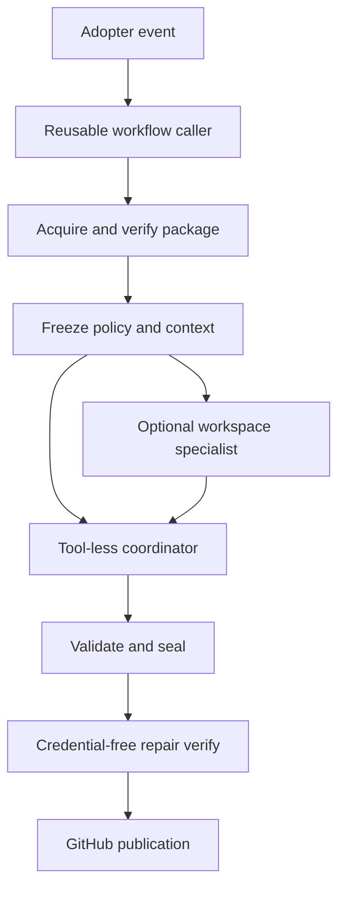

# Codekeeper architecture

Codekeeper is a versioned set of reusable GitHub Actions workflows for one repository at a time. It is not a hosted service. The repository contains three cooperating planes: the installer/package in `packages/codekeeper`, the nested runtime and workflow assets in `tools/codekeeper` and `.github`, and the adopter repository state generated under `.github`.

Caption: Runtime execution moves from an adopter event through frozen context and deterministic validation before credentialed mutation.

The central invariants are exact package/integrity verification, frozen context hashes, separate credentials, untrusted specialist evidence, bounded patches, App-identity ownership markers, and fail-closed publication. Read [configuration](configuration.md), [runtime security](../runtime/security.md), [workflows](../workflows/overview.md), and [release integrity](../installer/artifacts-and-releases.md) for canonical details.

Recent history emphasizes immutable release checkpoints, validation isolation, Codex pinning, and package-contract reconciliation; treat generated assets, manifests, workflow pins, and policy copies as synchronized change surfaces.
