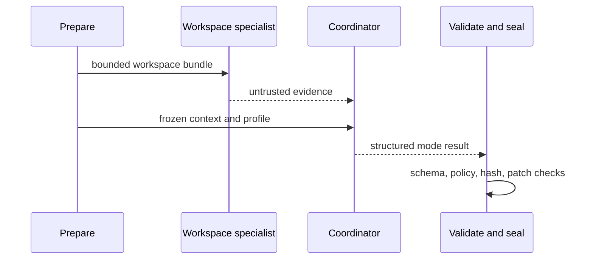

# Runtime execution, agents, and artifacts

`prepare.mjs` creates frozen review, audit, issue, or fix context. `agents-runtime.mjs` runs an optional Codex workspace specialist separately from the tool-less coordinator. The coordinator receives trusted frozen context and specialist output as untrusted evidence; it cannot shell out, access GitHub, or replace the selected profile.

Profiles are the public extension seam: packaged Markdown files in `tools/codekeeper/agents/` define reviewer, triager, auditor, and fixer behavior; `.github/codekeeper/agents/` may supply a reviewed default-branch override. `agent-profiles.mjs` selects the source, records provenance and SHA-256, and freezes exact bytes. `tools/codekeeper/presets/catalogue.mjs` defines evaluation/configuration presets rather than runtime authority.

The composite `tools/codekeeper/action.yml` bootstraps the verified tooling manifest, rejects hidden paths and symlinks, uploads a run-scoped artifact, and uses retention bounded to the workflow run. Later isolated jobs download and reverify it. Context, profile, package, specialist, coordinator, validation, candidate, and optional patch artifacts carry hashes so publication cannot mix runs.

Caption: Specialist evidence and trusted frozen context meet only at the coordinator boundary.

Focused tests include `agents-runtime`, `agent-profiles`, `presets`, tooling artifact, action/workflow contract, and integration suites. Profile changes require profile provenance tests and the package/staging checks.
